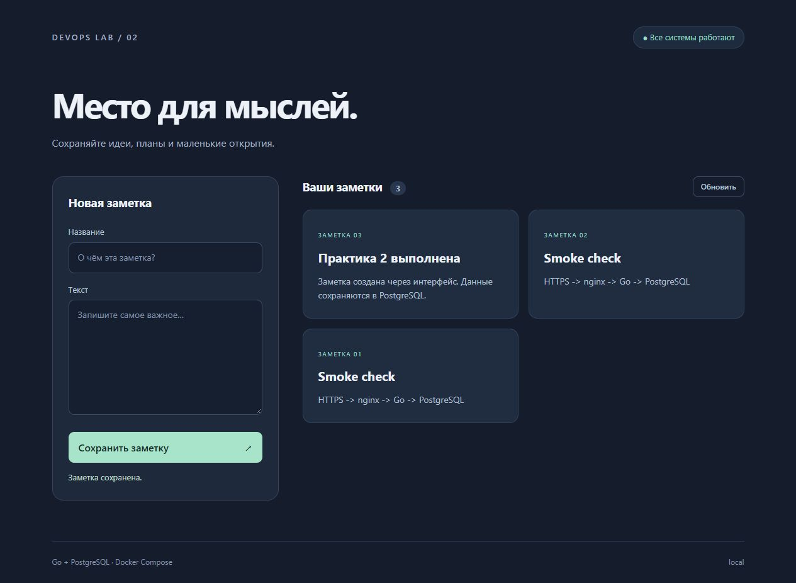

# Отчёт: практика 2 «Docker в production»

Дата выполнения: **4 октября 2026 года**, Europe/Moscow.
Работа выполнена локально на Docker Desktop с Linux containers.
Основной Compose-проект: `devops-lab02`.

## Результат

Создано и запущено приложение заметок: Vite SPA, Go API, PostgreSQL и nginx
с self-signed HTTPS. Все четыре штатных сервиса имеют статус **healthy**.
Приложение оставлено работающим на **https://localhost:8443**.
HTTP-вход **http://localhost:8088** возвращает 301 на HTTPS.
Порт 8080 был занят существующим приложением; его конфликт записан в первом
протоколе сборки, после чего HTTP-порт этого стенда изменён на 8088.

Исходный Ansible playbook перенесён в `lab-01/` без изменения содержимого;
оригинал задания PDF находится в `lab-02/практика 2 (2).pdf`. Корневой README содержит навигацию.
Локальные `.env`, TLS-ключ, `ssl/`, `node_modules/`, `dist/` и временные файлы
исключены из Git. Изменения оставлены в рабочем дереве для проверки;
commit и push не выполнялись.

## Проверенные критерии

| Проверка | Фактический результат | Протокол в evidence/ |
| --- | --- | --- |
| Сборка и запуск Compose | db/backend/frontend/nginx healthy | `20-final-status.log` |
| GET /health через HTTPS | HTTP 200, `{"db":true,"status":"ok"}` | `04-api-runtime.log` |
| Создание заметки | POST 201, возвращён ID | `04-api-runtime.log` |
| Чтение заметок и GET по ID | Данные возвращаются из PostgreSQL | `04-api-runtime.log`, `notes-final.json` |
| Форма SPA | Создана русская заметка через интерфейс, отображён статус БД | `12-ui-check.jpg` |
| Сохранение данных | Список до и после полного down/up совпал | `05-persistence-and-shutdown.log` |
| Multi-stage и кэш | Повторная сборка использует CACHED | `10-cached-build.log` |
| Изменение исходника | COPY/build пересобраны, go mod download остался CACHED | `14-source-change-cache.log` |
| Unit-тесты | Все четыре тестовых сценария прошли, без живой БД | `13-unit-tests.log` |
| Ограничения backend | 268435456 байт = 256 MiB, 1 CPU | `04-api-runtime.log` |
| Пользователь / PID 1 | UID 10001, `/app/notes` — PID 1; frontend и gateway UID 101 | `04-api-runtime.log` |
| Graceful shutdown | Логи SIGTERM → server stopped, exit 0, OOMKilled=false | `05-persistence-and-shutdown.log` |
| Завершение активного запроса | SELECT ожидал блокировку БД; при SIGTERM запрос завершился HTTP 200 | `15-active-request-shutdown.log` |
| TLS | TLS 1.3; issuer=subject; verify code 18 self-signed | `04-api-runtime.log` |
| nginx config | `nginx -t` успешно | `16-final-nginx.log` |
| Redirect HTTP → HTTPS | HTTP 301, Location `https://localhost:8443/` | `16-final-nginx.log` |

Unit-тесты проверяют readiness при исправной/недоступной БД, пустой список,
создание и получение заметки, неверный JSON, пустой title, неизвестные поля,
лишний JSON-объект, лимит тела 1 MiB, неверный ID, 404, 405 и ошибки БД.
`go vet ./...` также выполнен успешно. Фронтенд собран Vite 6.4.3;
проверка npm audit после обновления показала 0 уязвимостей.

## Диагностика обязательных поломок

### 1. DATABASE_URL с localhost

Эксперимент выполнен в отдельном проекте `lab02-localhost`.
`ps -a`: БД healthy, backend running, но **unhealthy**.
В логах: `DB not reachable at start; readiness will retry`.
`inspect` показал пять подряд неудачных healthcheck с HTTP 503; процесс не завершился.
`top` подтвердил живой `/app/notes`.
Проверка из контейнера показала, что имя `db` резолвится и порт 5432 доступен,
а на `localhost:5432` PostgreSQL отсутствует.

Причина: localhost обозначает сам backend-контейнер. После удаления ошибочного
overlay backend пересоздан с адресом `db`; `/health` снова вернул 200 и `db=true`.
Полный протокол: `06-localhost-failure.log`.

### 2. Убрана readiness-зависимость

Эксперимент выполнен в `lab02-race`: healthcheck БД выключен,
зависимость заменена на `service_started`, запуск PostgreSQL задержан на 12 секунд.
Backend начал слушать HTTP в **12:50:13 MSK**, а основной PostgreSQL сообщил
о готовности в **12:50:29 MSK**. Ранний `/health` вернул 503.
`inspect` показал неудачный healthcheck при живом процессе; `top` подтвердил PID.
После готовности БД повторный `/health` вернул 200; повторная проверка схемы
позволила восстановиться без перезапуска Go-процесса.

Штатный healthcheck и `service_healthy` возвращены; проект остановлен.
Полный протокол: `07-startup-race.log`.

### 3. Лимит 64 MiB / OOM

Эксперимент выполнен в `lab02-oom` с отдельным Docker target `diagnostics`.
Небольшой Go API использовал около 3 MiB, поэтому один лимит 64 MiB не вызвал бы
OOM автоматически. Диагностический бинарник выделял и заполнял блоки по 8 MiB.
Последний лог: **allocated 56 MiB**; следующая аллокация превысила лимит с учётом
памяти runtime и прочих накладных расходов.

`ps -a`: Exited (137). `inspect`: **OOMKilled=true**, **ExitCode=137**.
В `events` зарегистрированы события **oom** и **die** с exitCode=137.
Это подтверждает OOM, а не просто получение SIGKILL.
Бинарник нагрузки отсутствует в обычном target `runtime`.
Полный протокол: `08-oom.log`.

Все эксперименты остановлены, их контейнеры и сети удалены; тома сохранены.
Основной проект продолжает работать со штатными лимитами 256 MiB / 1 CPU.

## Образы и место на диске

Результат `docker image ls` в используемом Docker Desktop/containerd:

| Образ | Размер, показанный CLI | Пользователь |
| --- | ---: | --- |
| Go backend, multi-stage | 26.6 MB | app |
| Go backend, плохой Dockerfile | 1.51 GB | root |
| Vite frontend, runtime nginx | 92.5 MB | nginx |
| HTTPS nginx | 92.6 MB | nginx |

Плохой образ примерно в **57 раз больше** хорошего. Он содержит SDK, исходники,
модули, cache компиляции, встроенные учебные реквизиты и shell form CMD.
Первичная плохая сборка заняла примерно 70 секунд; повторная сборка штатного
стека с кэшем — около 8 секунд. Это разные условия кэширования/скачивания,
поэтому время приведено как наблюдение, а не равное сравнение производительности.

Поле `docker inspect .Size` использует другую метрику: backend 7.47 MB,
плохой образ 362.77 MB, frontend/gateway около 25.97 MB. Протоколы:
`02-bad-image-build.log`, `10-cached-build.log`, `11-image-sizes.log`.
Размеры отдельных образов нельзя просто складывать: слои разделяются.

`docker system df -v` показал, что основные потребители места на компьютере —
образы и build cache; полный снимок находится в `09-disk-usage.log`.
Общий `docker system prune` не запускался: в Docker присутствуют другие проекты.
Вместо него выполнен `docker image prune -a --force` с точным label
`com.docker.compose.project=lab02-oom`. Удалён только учебный OOM-образ,
освобождено 7.232 kB, поскольку его слои продолжают использоваться build cache.
Временный UI-контейнер удалён. Тома не очищались.
Протокол: `19-scoped-cleanup.log`.

## Дополнительные задания

- Отдельный healthcheck-скрипт backend реализован и используется Dockerfile/Compose.
  HTTP 503 превращается в ненулевой exit code wget; inline-проверка могла бы делать
  то же самое, но отдельный файл удобнее запускать вручную и расширять.
- BuildKit secret с публичной release metadata проверен отдельной сборкой:
  значение присутствует в JS bundle, исходный `/run/secrets/release` в runtime
  отсутствует (`18-release-secret.log`). Финальная проверка выявила остаточную
  release metadata в cache; штатный frontend пересобран без cache и проверено
  значение `local` (`21-release-cache-reset.log`). В Dockerfile добавлен публичный
  cache key `BUILD_VARIANT`, отдельные пути артефактов и явное значение по умолчанию.
  Повторная проверка подтвердила правильные метки и в release-сборке, и в обычной
  сборке, выполненной сразу после неё (`22-release-cache-isolation.log`).
- Явный `docker-compose.dev.yml` проверен на портах 9089/18000: HTTP gateway и
  прямой API отвечают, основной HTTPS-стек работает одновременно. Отдельный
  Compose project получил независимый том (`17-dev-override.log`).
- Redirect HTTP → HTTPS реализован; внешний HTTPS-порт подставляется при старте.
- Развёртывание на `web-server-1` и проверка Semaphore/Ansible по SSH не выполнены:
  исходный репозиторий не содержит inventory, адреса сервера и SSH-доступа.
  Это дополнительный удалённый этап; локальный независимый экземпляр проверен.

## Замечания к методичке

В реализации исправлены: отдельный модуль pgxpool, пустой Scan у INSERT,
ошибочный `<-ctx`, недоступные функции main в отдельной папке тестов,
отсутствующий proxy для `/health`, healthcheck с постоянным HTTP 200 при отказе
БД, отсутствующий каталог сертификатов и устаревшее утверждение о Compose secrets.
Детали и ссылки на первичную документацию приведены в README.

BuildKit secret mount сам по себе не включается в слой. Однако последующее
копирование TLS-ключа в итоговый образ сохраняет ключ в образе — именно так
сделано для учебного self-signed стенда по заданию. Реальные TLS-ключи так
передавать не следует. Локальный пароль PostgreSQL в образ не встроен.

## Интерфейс

Снимок сделан на временном HTTP-стенде с теми же frontend/API/БД, чтобы не обходить
предупреждение браузера о self-signed сертификате. HTTPS проверен отдельно CLI.
В консоли браузера ошибок и предупреждений не обнаружено.

Инструкции повторного запуска и команды проверок: [README.md](README.md).
